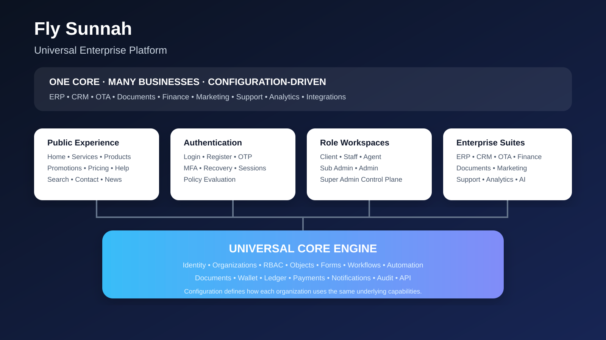

<div align="center">

# Fly Sunnah

### Universal Enterprise Platform

**One configurable core for businesses, teams, customers, operations and digital services.**

<p>
  <a href="https://github.com/flysunnah/Fly-Sunnah">Repository</a> ·
  <a href="docs/ARCHITECTURE.md">Architecture</a> ·
  <a href="docs/ROADMAP.md">Roadmap</a> ·
  <a href="docs/UI-APPLICATION-SURFACE.md">Application Surface</a>
</p>

</div>

---

<div align="center">



</div>

## The product

Fly Sunnah is being built as a **universal, configuration-driven enterprise platform** rather than a product locked to one industry. The core engine provides the capabilities; organizations configure how those capabilities are used.

That means the same platform can power a travel operation, service company, education business, agency, retail operation, internal enterprise workflow, or a future business model without rebuilding the foundation.

```text
CORE ENGINE
    │
    ├── Identity & Organizations
    ├── RBAC & Policy
    ├── Business / Object / Field Builder
    ├── Forms & Workflows
    ├── Automation & Rules
    ├── Documents & Files
    ├── Wallet / Ledger / Finance
    ├── CRM / Orders / Applications
    ├── Communication / Support
    ├── Analytics / Search / Audit
    └── API / Integration / White-label
              │
              ▼
        CONFIGURATION
              │
              ▼
      ANY BUSINESS / WORKSPACE
```

## One platform. Multiple experiences.

| Surface | Purpose |
|---|---|
| **Public** | Home, services, products, pricing, promotions, offers, campaigns, blog, FAQ, contact |
| **Authentication** | Login, registration, verification, OTP, MFA, recovery, invitations, sessions |
| **Client** | Dashboard, applications, orders, bookings, documents, invoices, wallet, messages, support |
| **Staff / Agent** | Assigned work, customers, leads, applications, documents, tasks, commission, reports |
| **Sub Admin** | Delegated staff, customers, operations, finance, documents, reports, configuration |
| **Admin** | Organization users, roles, branches, CRM, ERP, finance, documents, marketing, integrations |
| **Super Admin** | Global organizations, modules, builders, policies, feature flags, security, domains, health |

## Enterprise suites

### ERP
Accounting · Finance · Billing · Invoice · Expense · Procurement · Inventory · Warehouse · HR · Payroll · Assets · Reporting

### CRM
Leads · Contacts · Customers · Companies · Pipeline · Deals · Activities · Tasks · Follow-ups · Customer 360 · Sales Automation

### OTA / Travel
Flights · Hotels · Packages · Transfers · Activities · Visa · Umrah / Hajj · Booking · Reservation · Cancellation · Refund · Suppliers · Agents · Commission

### Documents
Document Manager · Template Builder · PDF · DOCX · Forms · Approval · Version Control · OCR · Verification · Secure Storage · Document Workflow

### Business Management
Business Builder · Services · Products · Branches · Departments · Teams · Staff · Customers · Vendors · Partners · Contracts · Workflows · Tasks

### Marketing & Sales
Campaigns · Promotions · Coupons · Discount Rules · Referral · Affiliate · Flash Offers · Landing Pages · Audience Segmentation · Quotations · Orders · Pricing · POS

### Finance
Wallet · Transactions · Ledger · Accounts · Payments · Refunds · Receivables · Payables · Commission · Tax · Financial Reports

### Communication & Support
Inbox · Live Chat · WhatsApp · Email · SMS · Internal Chat · Notifications · Tickets · Helpdesk · Knowledge Base · SLA · Escalation

### Projects & Analytics
Projects · Tasks · Kanban · Calendar · Milestones · Time Tracking · Dashboards · KPIs · Custom Reports · Data Explorer · Export

### AI & Integrations
AI Assistant · Document AI · OCR · Classification · Extraction · AI Search · Workflow AI · REST API · Webhooks · OAuth · Payment · Messaging · Travel · Accounting integrations

## Configuration is the product

The platform is designed around a strict separation:

**Core Engine → Configuration → Business Data**

Organizations can configure supported capabilities without modifying the application source:

- custom business objects
- custom fields and relationships
- dynamic forms
- workflow states and transitions
- automation rules
- pricing and discounts
- documents and templates
- notifications
- menus and module visibility
- permissions and scopes
- branding and domains
- feature flags

Configuration is versioned so changes can be reviewed and rolled back. Historical records retain the relevant configuration context.

## Security model

Authorization is enforced on the server/API layer; UI visibility is never treated as a security boundary.

```text
Super Admin
    ↓
Organization Admin
    ↓
Sub Admin
    ↓
Staff / Agent
    ↓
Client
```

Permissions are granular and scoped, for example:

`application.view` · `application.approve` · `invoice.create` · `invoice.void` · `wallet.credit` · `wallet.debit` · `user.create`

Supported scopes include global, organization, business unit, branch, department, team, self and assigned records.

Sensitive and financial actions are audited. Wallet and ledger operations are represented as transactions rather than arbitrary balance edits.

## White-label by organization

Every organization can have its own configured presentation while sharing the same core platform:

**Logo · Brand · Colors · Typography · Login · Dashboard · Email · Invoice · PDF · Support · Footer · Custom Domain**

## Fly Sunnah online presence

Official/known destinations and discovery profiles for the `flysunnah` identity are collected below. Links marked **Found** come from the supplied inventory; the remaining links are discovery/profile URLs and are not asserted as active accounts.

### Social & community

- [Facebook](https://facebook.com/search/top/?q=flysunnah)
- [Instagram](https://instagram.com/flysunnah)
- [TikTok — Found](https://tiktok.com/search?q=flysunnah)
- [YouTube](https://youtube.com/results?search_query=flysunnah)
- [X / Twitter](https://x.com/search?q=flysunnah&f=user)
- [Bluesky — Found](https://bsky.app/profile/flysunnah.bsky.social)
- [Threads](https://threads.com/@flysunnah)
- [LinkedIn](https://linkedin.com/search/results/people/?keywords=flysunnah)
- [Pinterest](https://pinterest.com/search/users/?q=flysunnah)
- [Telegram](https://t.me/flysunnah)
- [Reddit](https://reddit.com/search/?type=user&q=flysunnah)
- [Snapchat](https://snapchat.com/add/flysunnah)

### Developer & technology

- [GitHub — Found](https://github.com/flysunnah)
- [Bitbucket — Found](https://bitbucket.org/flysunnah)
- [GitLab](https://gitlab.com/search?search=flysunnah)
- [Codeberg](https://codeberg.org/flysunnah)
- [npm](https://npmjs.com/~flysunnah)
- [Docker Hub](https://hub.docker.com/u/flysunnah)
- [Replit](https://replit.com/@flysunnah)
- [Hugging Face](https://huggingface.co/flysunnah)
- [CodePen](https://codepen.io/flysunnah)
- [LeetCode](https://leetcode.com/u/flysunnah)
- [Kaggle](https://kaggle.com/flysunnah)
- [Codewars](https://codewars.com/users/flysunnah)

### Design & creative

- [Dribbble — Found](https://dribbble.com/search/users/flysunnah)
- [Behance](https://behance.net/search/users?search=flysunnah)
- [DeviantArt — Found](https://deviantart.com/search?q=flysunnah)
- [Flickr — Found](https://flickr.com/search/people/?username=flysunnah)
- [Unsplash](https://unsplash.com/s/users/flysunnah)
- [Pixabay](https://pixabay.com/users/search/flysunnah)
- [PicsArt](https://picsart.com/u/flysunnah)
- [ArtStation](https://artstation.com/flysunnah)
- [Giphy](https://giphy.com/flysunnah)
- [Civitai](https://civitai.com/user/flysunnah)

### Publishing & profiles

- [Medium — Found](https://medium.com/@flysunnah)
- [Substack](https://substack.com/@flysunnah)
- [Tumblr](https://flysunnah.tumblr.com/)
- [Quora](https://quora.com/search?q=flysunnah)
- [DEV Community](https://dev.to/flysunnah)
- [Hashnode](https://hashnode.com/@flysunnah)
- [Wikipedia](https://en.wikipedia.org/wiki/User:flysunnah)
- [Goodreads](https://goodreads.com/search?q=flysunnah&search_type=people)
- [Wattpad](https://wattpad.com/user/flysunnah)

### Creator & business profiles

- [Linktree — Found](https://linktr.ee/flysunnah)
- [Beacons](https://beacons.ai/flysunnah)
- [Bento](https://bento.me/flysunnah)
- [WordPress](https://flysunnah.wordpress.com/)
- [Blogspot](https://flysunnah.blogspot.com/)
- [Gravatar](https://gravatar.com/flysunnah)
- [About.me](https://about.me/flysunnah)
- [Fiverr](https://fiverr.com/flysunnah)
- [Upwork](https://upwork.com/freelancers/~flysunnah)
- [Freelancer](https://freelancer.com/u/flysunnah)
- [ResearchGate](https://researchgate.net/search/researcher?q=flysunnah)

### Media & music

- [Spotify](https://open.spotify.com/search/flysunnah)
- [SoundCloud](https://soundcloud.com/flysunnah)
- [Bandcamp](https://flysunnah.bandcamp.com/)
- [Mixcloud](https://mixcloud.com/flysunnah)
- [Suno](https://suno.com/@flysunnah)
- [Vimeo](https://vimeo.com/search/people?q=flysunnah)
- [Rumble](https://rumble.com/c/flysunnah)
- [Dailymotion](https://dailymotion.com/flysunnah)

## Architecture

The implementation direction is a modular enterprise core with strict module boundaries. It can begin as a modular monolith and extract independently scalable services only where justified.

```text
                         UNIVERSAL ENTERPRISE PLATFORM
                                      │
                         ┌────────────┴────────────┐
                         │     CONTROL PLANE       │
                         │ Super Admin / Security  │
                         └────────────┬────────────┘
                                      │
          ┌───────────────────────────┼───────────────────────────┐
          │                           │                           │
     PLATFORM CORE              BUSINESS CORE               ORG CORE
          │                           │                           │
          └───────────────────────────┼───────────────────────────┘
                                      │
                             ORGANIZATIONS
                                      │
                         ┌────────────┼────────────┐
                         B2B          B2C       INTERNAL
```

See [`docs/ARCHITECTURE.md`](docs/ARCHITECTURE.md) for the full blueprint and [`docs/DOMAIN-MODEL.md`](docs/DOMAIN-MODEL.md) for the domain model.

## Technology direction

- **Web:** React / Next.js direction
- **API:** TypeScript modular API architecture
- **Database:** PostgreSQL
- **Validation:** schema-driven validation
- **Auth:** secure sessions / token architecture with MFA support
- **Storage:** private object storage with controlled access
- **Realtime:** WebSocket / realtime event layer
- **Documents:** PDF / document generation modules
- **Deployment:** Vercel-compatible web/API surface with separable infrastructure

The stack can evolve without changing the universal business model.

## Repository status

This repository is in the **foundation-to-implementation phase**.

The original browser-based Document Workbench prototype remains available as `index.html`. It is not being discarded until the production application replacement is ready.

Current architectural documentation:

- [`docs/ARCHITECTURE.md`](docs/ARCHITECTURE.md)
- [`docs/ROADMAP.md`](docs/ROADMAP.md)
- [`docs/ROLES-PERMISSIONS.md`](docs/ROLES-PERMISSIONS.md)
- [`docs/DOMAIN-MODEL.md`](docs/DOMAIN-MODEL.md)
- [`docs/IMPLEMENTATION-STATUS.md`](docs/IMPLEMENTATION-STATUS.md)
- [`docs/UI-APPLICATION-SURFACE.md`](docs/UI-APPLICATION-SURFACE.md)

## Implementation roadmap

```text
FOUNDATION
  ├─ Repository / package structure
  ├─ Database model
  ├─ Auth + sessions
  ├─ RBAC / policy engine
  └─ API foundation

APPLICATION
  ├─ Public website
  ├─ Login / Register
  ├─ Client portal
  ├─ Staff / Agent workspace
  ├─ Admin / Sub Admin
  └─ Super Admin Control Plane

ENTERPRISE CORE
  ├─ Business Builder
  ├─ Forms / Fields / Objects
  ├─ Workflow / Automation
  ├─ Documents / Files
  ├─ Finance / Wallet / Ledger
  ├─ CRM / ERP
  └─ Communication / Support

SCALE
  ├─ White-label
  ├─ Integrations
  ├─ Analytics / AI
  ├─ System health
  └─ Backup / recovery / versioning
```

## Design direction

The application UI is intended to feel like a serious enterprise product: dense but readable information architecture, strong visual hierarchy, consistent design tokens, responsive layouts, accessible controls and role-aware navigation.

The README artwork is a product visualization, not a claim that every illustrated screen is already production-complete.

---

<div align="center">

**Fly Sunnah — Universal Enterprise Platform**  
*Build the business model once. Configure the experience for each organization.*

</div>
